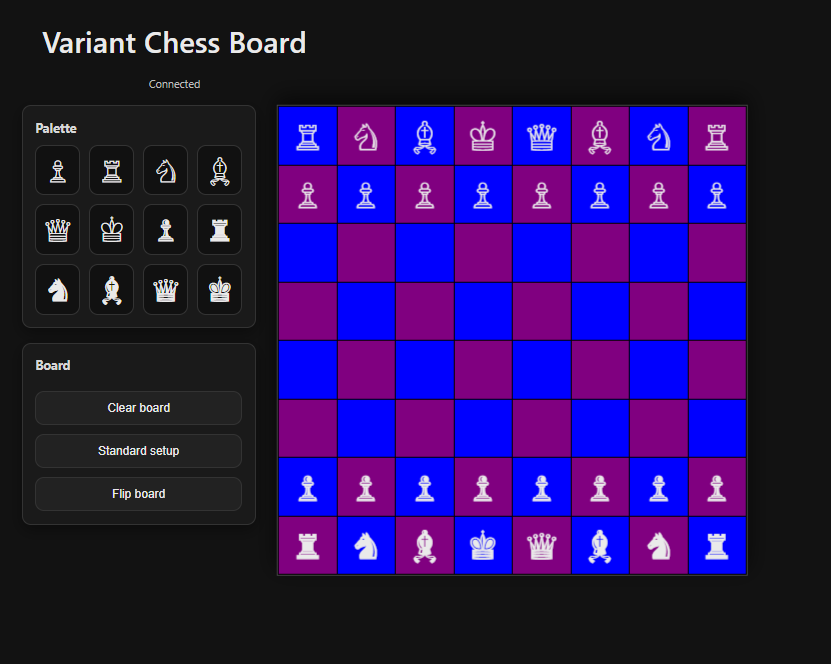
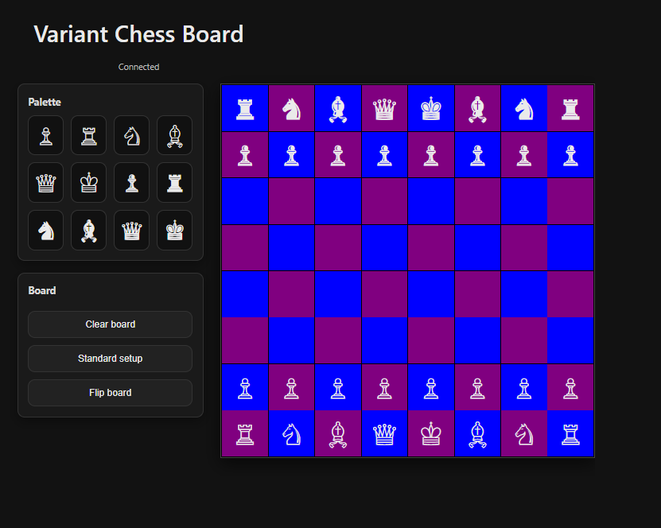
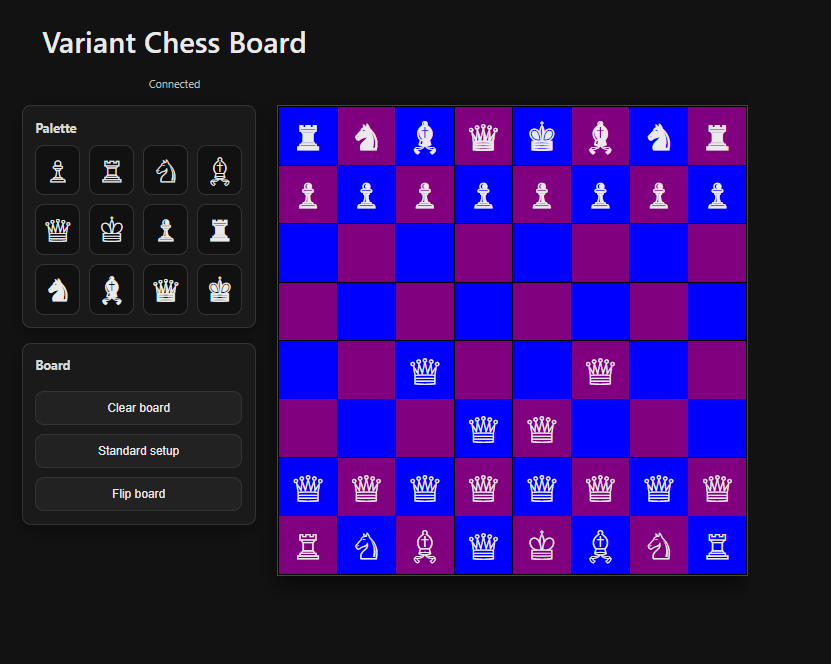

# Variant Chess Board (Realtime)

A lightweight, realtime, “over-the-board” chess sandbox for experimenting with chess rule variants.

Unlike a traditional chess UI, this project **does not enforce legal moves or turns**. Any user can move any piece, add extra pieces, or capture by overwrite — similar to what it feels like to play on a physical board, but shared live between two browsers.

## Live Demo
[https://otbchess.netlify.app](https://otbchess.netlify.app)

## Features
- Realtime shared board state (Supabase Postgres + Realtime)
- Infinite piece palette (drag pieces onto the board to create them)
- Move any piece by drag-and-drop
- Capture by overwrite (dropping onto an occupied square removes the occupant)
- Clear board (with confirmation)
- Standard chess setup button
- Flip board (local view)

## Screenshots

## Why this exists
Chess rule variants are fun, but most online boards assume standard rules and restrict moves. This project provides a shared “sandbox board” where players can prototype and play variants without a referee.

**Origin story (short):** My brother once proposed a variant idea (“Waterfall Chess”), and I realized the best way to explore it together wasn’t debating rules in theory — it was having a shared board where we could experiment live, from anywhere.

## Tech Stack
- HTML / CSS / Vanilla JavaScript
- Supabase (Postgres + Realtime)

## Security
- Supabase anon public key is used client-side (as intended by Supabase). Access is controlled via Row Level Security policies.
- V1 is intentionally an open sandbox with a single shared board; rooms and access control would be a natural next step.

## Notes / Limitations (V1)
- Single shared public board (no rooms yet)
- No authentication
- No move legality or turn enforcement by design
- UI prioritizes clarity and simplicity over “full chess client” behaviors

## Next Ideas
- Rooms / private links per game
- Optional “rules modules” (e.g., Waterfall Chess) layered on top of the sandbox
- Optimistic UI to remove the slight latency between drop and render
- Fun extras (e.g., table flip)
